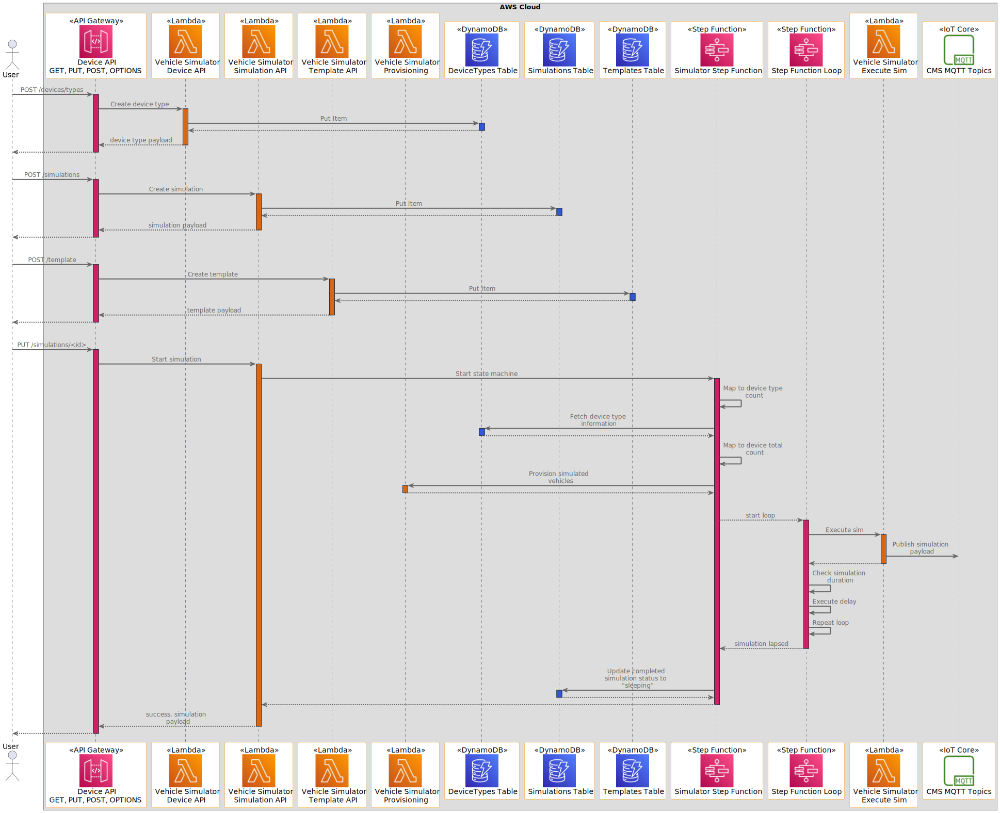

# API Lambda Handler

## AWS Chalice

[AWS Chalice Homepage](https://aws.github.io/chalice/index.html)

## AWS Lambda Powertools

[AWS Lambda Powertools Homepage](https://awslabs.github.io/aws-lambda-powertools-python/2.5.0/)

## API Routes

The full route list is viewable in API Gateway and a [Postman Collection](../../../documentation/postman/postman-cms-vehicle-simulator-dev.json)
is generated and stored in the documentation folder.

### Device Types

The simulator can send a user defined payload to IoT Core. Device types are where to create a desired data structure.
Also provided are vehicle specific templates covered in the [Device Templates](#device-templates) section.

### Simulations

A simulation is defined by the specific device type it should use and has settings for duration and interval.

### Device Templates

Templates are predefined data structures that can be selected for simulation.

- Vehicle Template uses the [Vehicle Signal Specification](https://github.com/COVESA/vehicle_signal_specification)

### Sequence Diagram

